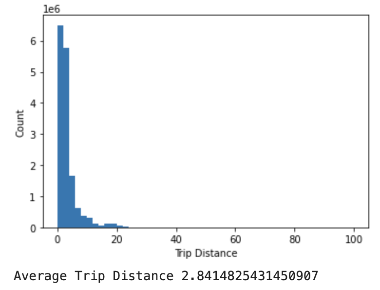
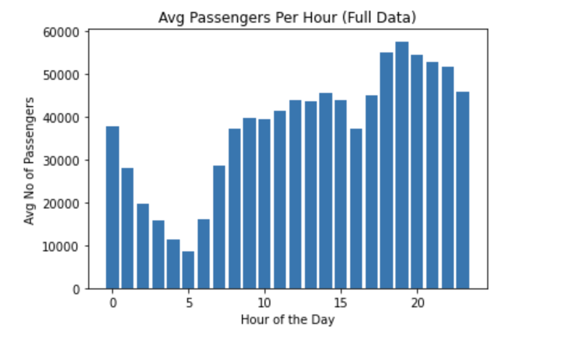
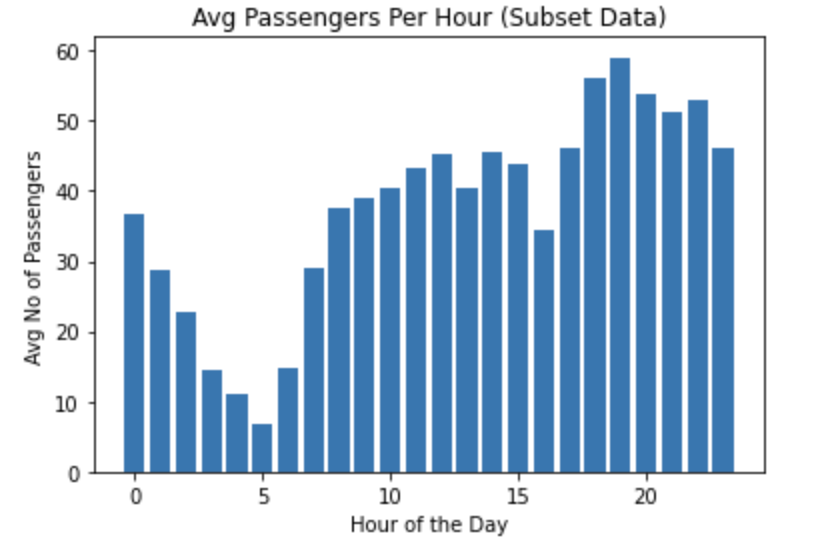

<h1>DATASET USED: "trip_data_3.csv"</h1> 

# QUESTION 1
<h5>1.	What datetime range does your data cover?  How many rows are there total?</h5>
ANSWER: The <strong>datetime range</strong> is from <strong>2013-03-01 00:00:00  to  2013-04-01 01:16:32</strong> (which is 29 days interval), and the <strong>Number of Rows</strong> is <strong>15749228</strong>. 
<br><br>


The code below was used to generate the results. Each row data is indexed on both pickup and dropoff datetimes, and the white space in the datetimes are replaced with `:` to ensure that it fits the datetime string format `"%Y-%m-%d:%H:%M:%S"`. The min and max datetimes are then found from the pickup and dropoff datetimes. At the same time, integer `n` is incremented after every row count until the last row in the dataset, where `n` is the total number of rows in the dataset.
<br>NOTE: The header row was not counted.

```python
# Datetine range
import csv, time,datetime
fn = 'trip_data_3.csv'
f = open(fn,'r')
reader = csv.reader(f)
n=0
mindate = None
maxdate = None

def update_dt(n, dto, mindate, maxdate):
    if n == 1:
        mindate = dto
        maxdate = dto
    elif dto < mindate:
        mindate = dto
    elif dto > maxdate:
        maxdate = dto
    return mindate, maxdate

for i, row in enumerate(reader):
    if i==0:continue  #Skip header
    n += 1 # row count
    p_dto, d_dto = None, None
    p_dts = row[5].replace(' ',':')
    d_dts = row[6].replace(' ',':')
    try:
        p_dto = datetime.datetime.strptime(p_dts, "%Y-%m-%d:%H:%M:%S")
    except Exception as e:
        print(e)
    try:
        d_dto = datetime.datetime.strptime(d_dts, "%Y-%m-%d:%H:%M:%S")
    except Exception as e:
        print(e)
    if p_dto is not None:
        mindate, maxdate = update_dt(n, p_dto, mindate, maxdate)
    if d_dto is not None:
        mindate, maxdate = update_dt(n, d_dto, mindate, maxdate)
        
print('Datetime Range:', mindate,' to ', maxdate, '\nNumber of Rows:', n)
f.close()
```


# QUESTION 2
<h5>2.	What are the field names?  Give descriptions for each field.</h5>
ANSWER: The field names are shown in the table below. In the code solution, the field names were automatically generated from the header row in the dataset. The header row was then splitted into the field names. The field description was manually entered into the generated table.
<br><br>

Field Names | Description
------ | ------
medallion|A taxi medallion, also known as a CPNC (Certificate of Public Necessity and Convenience), is a transferable permit in the United States allowing a taxicab driver to operate.
 hack_license|A license given to an individual who meets the United States residency, New York State Department of Motor Vehicle licensing, New York State Department of Financial Services, New York State Tax and Finance, and agency criteria for the privilege of driving a taxicab in the State of New York.
 vendor_id|A code indicating the provider associated with the trip record. There are 2 taxi companies (CMT and VTS).
 rate_code|Rate codes are used to define the various prices for each room type over a particular date range or rate season. The maximum rate code value is 210.
 store_and_fwd_flag|This flag indicates whether the trip record was held in vehicle memory before sending to the vendor because the vehicle did not have a connection to the server (Y=store and forward; N=not a store and forward trip).
 pickup_datetime|The date and time when the meter was engaged. This is currently a combination of date and time in Y-M-D H:M:S format.
 dropoff_datetime|The date and time when the meter was disengaged. This is currently a combination of date and time in Y-M-D H:M:S format.
 passenger_count|The number of passengers in the vehicle. The maximum value is 9. However, a wrong value of 255 was recorded in the data but no taxi can have a passenger count of 255.
 trip_time_in_secs|Time for completing trip in seconds.
 trip_distance|The distance of the trip.
 pickup_longitude|The longitude where the meter was engaged. Some cordinates are incorrect and are not in the range -180 and 180, and some are out of New York state coordinates.
 pickup_latitude|The latitude where the meter was engaged. Some cordinates are incorrect and are not in the range -90 and 90, and some are out of New York state coordinates.
 dropoff_longitude|The longitude where the meter was disengaged. Some cordinates are incorrect and are not in the range -180 and 180, and some are out of New York state coordinates.
 dropoff_latitude|The latitude where the meter was disengaged. Some cordinates are incorrect and are not in the range -90 and 90, and some are out of New York state coordinates.
 
 
```python
import csv, time,datetime
fn = 'trip_data_3.csv'
f = open(fn,'r')
reader = csv.reader(f)

ss = 'Field Names | Description\n------ | ------\n'
for row in reader:
    for field in row:
        ss+=field+'|-\n'
    break
print(ss)
f.close()
```
 
 
# QUESTION 3
<h5>3.	Give some sample data for each field.</h5>
ANSWER: The field names and sample data are shown in the table below. The code solution below was used to automatically generate the field names and sample data table. Please note that only the header row and one row of data (next row after the header row) from the dataset were used and then splitted into the field names and corresponding sample data.
<br><br>

 Field Names | Sample Data
------ | ------
medallion|FE7B354FEB67B9C94BD34EA54469691C
 hack_license|2C78614ADC9C602EC70D65CCB4E63B14
 vendor_id|CMT
 rate_code|1
 store_and_fwd_flag|N
 pickup_datetime|2013-03-01 00:00:04
 dropoff_datetime|2013-03-01 00:19:03
 passenger_count|1
 trip_time_in_secs|1138
 trip_distance|14.30
 pickup_longitude|-73.776703
 pickup_latitude|40.645164
 dropoff_longitude|-73.913925
 dropoff_latitude|40.772614
 
 ```python
import csv, time,datetime
fn = 'trip_data_3.csv'
f = open(fn,'r')
reader = csv.reader(f)
dic =  []
ss = 'Field Names | Sample Data\n-- | --\n'
for i, row in enumerate(reader):
    if i==0:
        dic=row
    if i==1:
        for e in range(len(dic)):
            ss+=dic[e]+'|'+row[e]+'\n'
        break
print(ss)
f.close()
 ```
 
# QUESTION 4
<h5>4.	What MySQL data types / len would you need to store each of the fields?</h5>
ANSWER: Although the data types can be found by manually inspecting the field names and few sample data, however, I wrote a code to automatically detect the field names and data types. Also, the data type length can be estimated after a careful manual observation of several sample data, but towards finding the actual/perfect length for each data type, I wrote a code to automatically look into all rows of the data and find the best/maximum length required (The code takes longer time to run but it is more accurate than mere assumption or guessing). The table below shows the data type and length. The code is also shown below.
<br><br>


Field Names | Sample Data
------ | ------
medallion|varchar(32)
 hack_license|varchar(32)
 vendor_id|varchar(3)
 rate_code|int(3)
 store_and_fwd_flag|varchar(1)
 pickup_datetime|datetime
 dropoff_datetime|datetime
 passenger_count|int(3)
 trip_time_in_secs|int(5)
 trip_distance|decimal(4,2)
 pickup_longitude|decimal(12,11)
 pickup_latitude|decimal(11,10)
 dropoff_longitude|decimal(12,11)
 dropoff_latitude|decimal(11,10)


```python
import csv, time,datetime

def getCount(e):
    i,max_len, dec_len=0,0,0
    f = open(fn,'r')
    reader = csv.reader(f)
    for row in reader:
        i+=1
        if i==1:continue
        if '.' in row[e]:
            val1=len(str(float(row[e])).replace('.','').replace('-','')) #before the decimal point
            val2=len(str(float(row[e])).split('.')[1]) # after the decimal point
            if max_len < val1:
                max_len=val1
            if dec_len < val2:
                dec_len=val2
    return '('+str(max_len)+','+str(dec_len)+')'

def getCount2(e,d_type):
    i, max_len=0,0
    f = open(fn,'r')
    reader = csv.reader(f)
    for row in reader:
        i+=1
        if i==1:continue
        if d_type=='int':
            val=len(row[e].replace('-',''))
            if max_len < val:
                max_len = val
        elif d_type=='var':
            val=len(row[e])
            if max_len < val:
                max_len = val
    return '('+str(max_len)+')'


fn = 'trip_data_3.csv'
f = open(fn,'r')
reader = csv.reader(f)
field_names=[]
d_type=''
for i, row in enumerate(reader):
    if i==2:break
    if i==0:
        field_names=row
        continue
    ss = 'Field Names | Sample Data\n------ | ------\n'
    if i==1:
        for e in range(len(row)):
            try:
                dto = datetime.datetime.strptime(row[e].replace(' ',':'), "%Y-%m-%d:%H:%M:%S")
                d_type='datetime'
            except Exception as k:
                if '.' in row[e]: # is decimal
                    count = getCount(e)
                    d_type='decimal'+count
                else:
                    try:
                        val=int(row[e])
                        count = getCount2(e,'int')
                        d_type='int'+count
                    except Exception as k:
                        count = getCount2(e,'var')
                        d_type='varchar'+count
            ss+=field_names[e]+'|'+d_type+'\n'
print(ss)
f.close()
```


# QUESTION 5
<h5>5.	What is the geographic range of your data (min/max - X/Y)?<br>
a.	Plot this (approximately on a map)</h5>
ANSWER: In finding the geographical range, both the pickup and dropoff coordinates are used. First, the cordinates were inspected to ensure they are valid floats and then to ensure they are valid coordinates and are within the set range for New York coordinates. The New York reference coordinates used are:
<ul>
    <li>"min_lat": 40.4772</li>
    <li>"max_lat": 45.0153</li>
    <li>"min_lng": -79.7624</li>
    <li>"max_lng": -71.7517</li>
</ul>
<br>
Below is the table showing the min and max coordinates and range in the dataset.

Coordinate | Min | Max | Range
----- | --- | --- | ---
Longitude|-79.73333|-71.800003|7.933326999999991
Latitude|40.477215|44.983334|4.506118999999998

Below are the images (Satelite and Map view) showing the bounding points (in red) based on the min and max coordinates.


```python

import csv, time,datetime
fn = 'trip_data_3.csv'
ss = 'Coordinate | Min | Max | Range\n----- | --- | --- | ---\n'
min_lon, min_lat, max_lon, max_lat=100.0,100.0,-180,0.0


def update_cord(lon, lat, min_lon, min_lat, max_lon, max_lat):
    if min_lon > lon:
        min_lon=lon
    if max_lon < lon:
        max_lon=lon
    if min_lat > lat:
        min_lat=lat
    if max_lat < lat:
        max_lat=lat
    return min_lon, min_lat, max_lon, max_lat
    
i, min_, max_=0,100,0
f = open(fn,'r')
reader = csv.reader(f)
for row in reader:
    i+=1
    if i==1:continue
    p_lon=row[10]
    p_lat=row[11]
    d_lon=row[12]
    d_lat=row[13]
    if '.' in p_lon and '.' in p_lat: #it's a valid decimal
        #validate lon & lat to be in NY region
        if not float(-79.7624)<=float(p_lon)<=float(-71.7517): continue
        if not float(40.4772)<=float(p_lat)<=float(45.0153): continue
        min_lon, min_lat, max_lon, max_lat = update_cord(float(p_lon), float(p_lat), min_lon, min_lat, max_lon, max_lat)
    
    if '.' in d_lon and '.' in d_lat: #it's a valid decimal
        #validate lon & lat to be in NY region
        if not float(-79.7624)<=float(d_lon)<=float(-71.7517): continue
        if not float(40.4772)<=float(d_lat)<=float(45.0153): continue
        min_lon, min_lat, max_lon, max_lat = update_cord(float(d_lon), float(d_lat), min_lon, min_lat, max_lon, max_lat)
        
ss+='Longitude|'+str(min_lon)+'|'+str(max_lon)+'|'+str(max_lon-min_lon)+'\n'
ss+='Latitude|'+str(min_lat)+'|'+str(max_lat)+'|'+str(max_lat-min_lat)+'\n'
f.close()
print(ss)
```


# QUESTION 6
<h5>6.	What is the average trip distance? (You should use Haversine Distance) <br>
a.	Draw a histogram of the trip distances binned anyway you see fit.
</h5>
ANSWER: The average trip distance is approximately <strong>2.08</strong> as shown in the Table 6.2 below. In the code solution, the raw data cordinates were inspected to ensure they are valid floats and then to ensure they are valid coordinates and are within the set range for New York coordinates. The New York reference coordinates used are:
<ul>
    <li>"min_lat": 40.4772</li>
    <li>"max_lat": 45.0153</li>
    <li>"min_lng": -79.7624</li>
    <li>"max_lng": -71.7517</li>
</ul>

A haversine function was created that takes in the pickup and dropoff coordinates and outputs the trip distance in miles. `trip_d` is a list of all the trip distances, while `dhist` is a dictionary of trip distance range and their respective counts. As shown in Table 6.1, most of the trip distances are within the range `0-50`. This is also evident in the histogram below. Table 6.2 shows the minimum, maximum and average trip distance.


Since `trip_d` is a list of all the trip distances, the average trip distance is calculated using `avg=sum(y)/len(y)`. The histogram was plotted with `bins=100` using `matplotlib` which was not shown in the code because it requires installing additional library.
<br><br>

Table 6.1

Trip Distance Range | Total count
---------|--------
0-50|15447054
51-100|233
101-150|100
151-200|87
201-250|85
251-300|85
301-350|5
351-400|1

Table 6.2

Trip Distance | Value 
---------|--------
Minimum|0.0
Maximum|393.60494339271463
Average|2.076935784621777





```python
from math import radians, cos, sin, asin, sqrt
import csv, time,datetime

def haversine(lon1, lat1, lon2, lat2):
    # convert decimal degrees to radians 
    lon1, lat1, lon2, lat2 = map(radians, [lon1, lat1, lon2, lat2])

    # haversine formula 
    dlon = lon2 - lon1 
    dlat = lat2 - lat1 
    a = sin(dlat/2)**2 + cos(lat1) * cos(lat2) * sin(dlon/2)**2
    c = 2 * asin(sqrt(a)) 
    r = 3956 # Radius of earth in miles
    return c * r

fn = 'trip_data_3.csv'
f = open(fn,'r')
reader = csv.reader(f)
trip_d=[]
dhist={}
i = 0
for row in reader:
    i+=1
    if i==1:continue # skip header row
    p_lon=row[10]
    p_lat=row[11]
    d_lon=row[12]
    d_lat=row[13]
    if '.' in p_lon and '.' in p_lat and '.' in d_lon and '.' in d_lat: #it's a valid decimal
        #ensure lon & lat are valid NY coordinates
        if not float(-79.7624)<=float(p_lon)<=float(-71.7517): continue
        if not float(40.4772)<=float(p_lat)<=float(45.0153): continue
        if not float(-79.7624)<=float(d_lon)<=float(-71.7517): continue
        if not float(40.4772)<=float(d_lat)<=float(45.0153): continue
        dist = haversine(float(p_lon), float(p_lat), float(d_lon), float(d_lat))
        trip_d.append(dist)

for d in trip_d:
    r = d//50
    if r == float(0):
        key='0-50'
        if key in dhist:
            dhist[key]+=1
        else:
            dhist[key]=1
    else:
        key=str(int(50.0*r)+1)+'-'+str(int(50.0*(r+1.0)))
        if key in dhist:
            dhist[key]+=1
        else:
            dhist[key]=1

s = 'Trip Distance Range | Total count \n'
for k,v in dhist.items():
    s+=str(k)+'|'+str(v)+'\n'
print(s)

ss = 'Trip Distance | Value \n'  
ss+='Minimum|'+ str(min(trip_d))+'\n'
ss+='Maximum|'+str(max(trip_d))+'\n'
ss+='Average|'+str(sum(trip_d)/len(trip_d))+'\n'
print(ss)

f.close()
```


# QUESTION 7
<h5>7.	What are the distinct values for each field? (If applicable)
</h5>
ANSWER: I wrote a code that automatically count the distinct values for each field and append the distinct values to their respective field names in a dictionary. If the distinct values count are greater than a threshold (20 was used in my code), then it is considered that the field's distinct values are too much, and hence, the code stops finding the distinct values for that field, discard the field name in the dictionary and moves on to the next field name. The table below is the list of fields that have distinct value count less than 20.
<br><br>

Field Names | Distinct Values 
---|---
 vendor_id|'CMT', 'VTS'
 rate_code|'1', '2', '5', '3', '4', '6', '0', '210', '9', '7', '8', '17'
 store_and_fwd_flag|'N', 'Y', ''
 passenger_count|'1', '2', '4', '3', '5', '6', '0', '9', '7', '255'
 
```python
import csv, time,datetime
import matplotlib.pyplot as plt
fn = 'trip_data_3.csv'

hist={}
for pos in range(14):
    key=''
    f = open(fn,'r')
    reader = csv.reader(f)
    for i, row in enumerate(reader):
        if i==0:
            key = row[pos]
            hist[key]=[]
            continue
        content = row[pos]
        if content not in hist[key]:
            hist[key].append(content)
        if len(hist[key]) > 20:
            hist.pop(key, None)
            break
  
s = 'Field Names | Distinct Values \n---|--\n'
for k,v in hist.items():
    s+=str(k)+'|'+str(v).replace('[','').replace(']','')+'\n'
print(s)
f.close()
```

# QUESTION 8
<h5>8.	For other numeric types besides lat and lon, what are the min and max values?
</h5>
ANSWER: Other numeric types besides latitude and longitude are <strong>rate code, passenger count and trip time</strong>. I have writen a code to automatically find the minimum and maximum value in each of the numeric fields and then I manually commented on the observed values.

Field Names | Min | Max | Comments
----- | --- | --- |--
 rate_code|0|210|The unique values are `0, 1, 2, 3, 4, 5, 6, 7, 8, 9, 17, 210`.
 passenger_count|0|9|There was an extreme false value of 255 recorded in the data. However, no taxi can have a passenger count of 255. So, the value was discarded. 
 trip_time_in_secs|0|10800|The maximum trip time is 10800 sec (3 hours).
 
```python
import csv, time,datetime
fn = 'trip_data_3.csv'
ss = 'Field Names | Min | Max | Comments\n---|---|---|--\n'
for pos in [3,7,8,]:
    f_n=''
    i, min_, max_=0,100,0
    f = open(fn,'r')
    reader = csv.reader(f)
    for row in reader:
        i+=1
        if i==1:
            f_n=row[pos]
            continue
        val=int(row[pos])
        if min_ > val:
            min_=val
        if max_ < val:
            if pos==7:
                if val<=9:
                    max_=val
            else:
                max_=val    
    ss+=f_n+'|'+str(min_)+'|'+str(max_)+'|-\n'
    f.close()
print(ss)
```
 

# QUESTION 9
<h5>9.	Create a chart which shows the average number of passengers each hour of the day. (X axis should have 24 hours)
</h5>

ANSWER: The hour of day was captured from the timestamp using the code`hr=int(row[5].split()[1].split(':')[0])` and the hour of day is added as the key in a dictionary called `hrhist` which is a dictionary of lists. If hour of day exist in dictionary, the passenger count is appended to the list as values, if it does not exist, the passenger count is set as the first element of the list. Thereafter, `x` is a list of all hour of day, and `y` is a list of the average number of passengers in each hour. This is achieved by dividing the sum of passenger in each hour by 29 (number of days in my dataset). Finally, a bar plot of `x` and `y` is plotted `plt.bar(x,y)` and shown below using matplotlib but the plotting code is not shown here because it requires installing an external library.



```python
import csv, time,datetime
fn = 'trip_data_3.csv'
f = open(fn,'r')
reader = csv.reader(f)
hrhist={}
x,y=[],[]

for i, row in enumerate(reader):
    if i==0:continue  #Skip header
    hr = int(row[5].split()[1].split(':')[0])
    pass_count=int(row[7])
    if hr in hrhist:
        hrhist[hr].append(pass_count)
    else:
        hrhist[hr]=[pass_count]
#         print('first',hrhist)
for k,v in hrhist.items():
    x.append(k)
    y.append(sum(v)/29)
```


# QUESTION 10
<h5>10.	Create a new CSV file which has only one out of every thousand rows.
</h5>

ANSWER: In the code solution below, the output file `trip_data_3_subset.csv` was opened using write mode. This way, everytime the code is run, it cleans previous record before writing to the file. The condition `if i%1000==0:` ensures that data is written only once out of every thousand. The code also investigate the number of rows in the subset data. <strong>The subset data has 15749 rows</strong> which is accurate.

```python
import csv, time,datetime
fn = 'trip_data_3.csv'
f = open(fn,'r')
reader = csv.reader(f)

f2 = open('trip_data_3_subset.csv','w')
writer = csv.writer(f2,delimiter=',',lineterminator='\n')
for i, row in enumerate(reader):
    if i==0:
        writer.writerow(row) #Write field names
        continue
    if i%1000==0:
        writer.writerow(row)
f.close()
f2.close()

#Check max row of the subset data
fn = 'trip_data_3_subset.csv'
f = open(fn,'r')
n=0
reader = csv.reader(f)
for i, row in enumerate(reader):
    if i==0:continue # Skip the header row
    n+=1
print('The subset data has', n, 'rows')
```


# QUESTION 11
<h5>11.	Repeat step 9 with the reduced dataset and compare the two charts.
</h5>
ANSWER: The figure below shows the bar chat of the average passengers per hour when repeating step 9 with the reduced/subset dataset. Comapring the two charts, it is seen that both charts look almost the same (with negligible differences) <strong>but the y-axis of the subset plot is shrinked by a thousand</strong>. This is because, each data point in the subset dataset is created after every thousand rows.
Conclusively, although the reduced data is a subset of the full dataset, it still have a good representation of the full data, but more accurate analysis can be obtained from the full data. Below is also the code for plotting the bar code for the subset data.
Matplotlib was used in plotting the chart similar to question 9, but the plotting code is not shown here because it requires installing an external library.
<br><br>




```python
import csv, time,datetime
fn = 'trip_data_3_subset.csv'
f = open(fn,'r')
reader = csv.reader(f)
hrhist={}
x,y=[],[]

for i, row in enumerate(reader):
    if i==0:continue  #Skip header
    hr = int(row[5].split()[1].split(':')[0])
    pass_count=int(row[7])
    if hr in hrhist:
        hrhist[hr].append(pass_count)
    else:
        hrhist[hr]=[pass_count]
#         print('first',hrhist)
for k,v in hrhist.items():
    x.append(k)
    y.append(sum(v)/len(v))
```