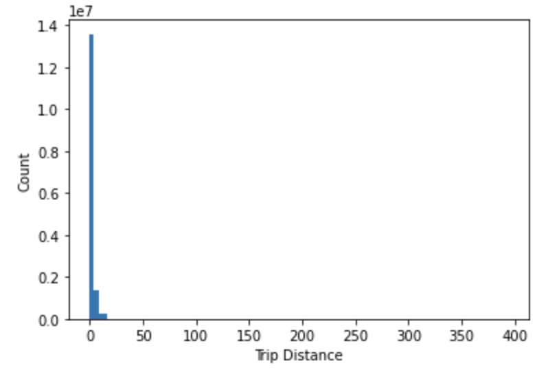

# QUESTION 1
<h5>1.	What datetime range does your data cover?  How many rows are there total?</h5>
ANSWER: The <strong>datetime range</strong> is from <strong>2013-03-01 00:00:00  to  2013-03-31 00:00:00</strong>, and the <strong>Number of Rows</strong> is <strong>15749228</strong>
<br><br>


The code below was used to generate the results.
```python
import csv, time,datetime
fn = 'trip_data_3.csv'
f = open(fn,'r')
reader = csv.reader(f)
n=0
mindate = None
maxdate = None

for i, row in enumerate(reader):
    if i==0:continue  #Skip header
    n += 1 # row count
    dts = row[5].split()[0]
    dto = None
    try:
        dto = datetime.datetime.strptime(dts, "%Y-%m-%d")
    except Exception as e:
        print(e)
    if dto is not None:
        if i == 1:
            mindate = dto
            maxdate = dto
        elif dto < mindate:
            mindate = dto
        elif dto > maxdate:
            maxdate = dto
print('Datetime Range:', mindate,' to ', maxdate, '\nNumber of Rows:', n)
f.close()
```


# QUESTION 2
<h5>2.	What are the field names?  Give descriptions for each field.</h5>
ANSWER: The field names are shown in the table below. In the code solution which was used in automatically generating the field names table, only the header row from the dataset was used and then splitted into the field names. The field description was manually entered into the generated table.
<br><br>

Field Names | Description
------ | ------
medallion|A taxi medallion, also known as a CPNC (Certificate of Public Necessity and Convenience), is a transferable permit in the United States allowing a taxicab driver to operate.
 hack_license|A license given to an individual who meets the United States residency, New York State Department of Motor Vehicle licensing, New York State Department of Financial Services, New York State Tax and Finance, and agency criteria for the privilege of driving a taxicab in the State of New York.
 vendor_id|A code indicating the provider associated with the trip record. There are 2 taxi companies (CMT and VTS).
 rate_code|Rate codes are used to define the various prices for each room type over a particular date range or rate season. The maximum rate code value is 210.
 store_and_fwd_flag|This flag indicates whether the trip record was held in vehicle memory before sending to the vendor because the vehicle did not have a connection to the server (Y=store and forward; N=not a store and forward trip).
 pickup_datetime|The date and time when the meter was engaged. This is currently a combination of date and time in Y-M-D H:M:S format.
 dropoff_datetime|The date and time when the meter was disengaged. This is currently a combination of date and time in Y-M-D H:M:S format.
 passenger_count|The number of passengers in the vehicle. The maximum value is 9. However, a wrong value of 255 was recorded in the data but no taxi can have a passenger count of 255.
 trip_time_in_secs|Time for completing trip in seconds.
 trip_distance|The distance of the trip.
 pickup_longitude|The longitude where the meter was engaged. Some cordinates are incorrect and are not in the range -180 and 180, and some are out of New York state coordinates.
 pickup_latitude|The latitude where the meter was engaged. Some cordinates are incorrect and are not in the range -90 and 90, and some are out of New York state coordinates.
 dropoff_longitude|The longitude where the meter was disengaged. Some cordinates are incorrect and are not in the range -180 and 180, and some are out of New York state coordinates.
 dropoff_latitude|The latitude where the meter was disengaged. Some cordinates are incorrect and are not in the range -90 and 90, and some are out of New York state coordinates.
 
 
```python
import csv, time,datetime
fn = 'trip_data_3.csv'
f = open(fn,'r')
reader = csv.reader(f)

ss = 'Field Names | Description\n------ | ------\n'
for row in reader:
    for field in row:
        ss+=field+'|-\n'
    break
print(ss)
f.close()
```
 
 
# QUESTION 3
<h5>3.	Give some sample data for each field.</h5>
ANSWER: The field names and sample data are shown in the table below. In the code solution which was used in automatically generating the field names and sample data table, only the header row and one row of data from the dataset were used and then splitted into the field names with corresponding sample data.
<br><br>

 Field Names | Sample Data
------ | ------
medallion|FE7B354FEB67B9C94BD34EA54469691C
 hack_license|2C78614ADC9C602EC70D65CCB4E63B14
 vendor_id|CMT
 rate_code|1
 store_and_fwd_flag|N
 pickup_datetime|2013-03-01 00:00:04
 dropoff_datetime|2013-03-01 00:19:03
 passenger_count|1
 trip_time_in_secs|1138
 trip_distance|14.30
 pickup_longitude|-73.776703
 pickup_latitude|40.645164
 dropoff_longitude|-73.913925
 dropoff_latitude|40.772614
 
 ```python
import csv, time,datetime
fn = 'trip_data_3.csv'
f = open(fn,'r')
reader = csv.reader(f)
dic =  []
ss = 'Field Names | Sample Data\n-- | --\n'
for i, row in enumerate(reader):
    if i==0:
        dic=row
    if i==1:
        for e in range(len(dic)):
            ss+=dic[e]+'|'+row[e]+'\n'
        break
print(ss)
f.close()
 ```
 
# QUESTION 4
<h5>4.	What MySQL data types / len would you need to store each of the fields?</h5>
ANSWER: Although the data types can be found by manually inspecting the field names and sample data, however, I wrote and code to automatically detect it. Also, the length can be estimated after careful manual observation of few sample data, but towards finding the actual length for each data type, I wrote a code to automatically look into the data and find the best length (It takes a while to finish but it is more accurate than mere assumption). The table below shows the data type and length and the code is also shown below.
<br><br>


Field Names | Sample Data
------ | ------
medallion|varchar(32)
 hack_license|varchar(32)
 vendor_id|varchar(3)
 rate_code|int(3)
 store_and_fwd_flag|varchar(1)
 pickup_datetime|datetime
 dropoff_datetime|datetime
 passenger_count|int(3)
 trip_time_in_secs|int(5)
 trip_distance|decimal(4,2)
 pickup_longitude|decimal(12,11)
 pickup_latitude|decimal(11,10)
 dropoff_longitude|decimal(12,11)
 dropoff_latitude|decimal(11,10)


```python
import csv, time,datetime

def getCount(e):
    i,max_len, dec_len=0,0,0
    f = open(fn,'r')
    reader = csv.reader(f)
    for row in reader:
        i+=1
        if i==1:continue
        if '.' in row[e]:
            val1=len(str(float(row[e])).replace('.','').replace('-','')) #before the decimal point
            val2=len(str(float(row[e])).split('.')[1]) # after the decimal point
            if max_len < val1:
                max_len=val1
            if dec_len < val2:
                dec_len=val2
    return '('+str(max_len)+','+str(dec_len)+')'

def getCount2(e,d_type):
    i, max_len=0,0
    f = open(fn,'r')
    reader = csv.reader(f)
    for row in reader:
        i+=1
        if i==1:continue
        if d_type=='int':
            val=len(row[e].replace('-',''))
            if max_len < val:
                max_len = val
        elif d_type=='var':
            val=len(row[e])
            if max_len < val:
                max_len = val
    return '('+str(max_len)+')'


fn = 'trip_data_3.csv'
f = open(fn,'r')
reader = csv.reader(f)
field_names=[]
d_type=''
for i, row in enumerate(reader):
    if i==2:break
    if i==0:
        field_names=row
        continue
    ss = 'Field Names | Sample Data\n------ | ------\n'
    if i==1:
        for e in range(len(row)):
            try:
                dto = datetime.datetime.strptime(row[e].replace(' ',':'), "%Y-%m-%d:%H:%M:%S")
                d_type='datetime'
            except Exception as k:
                if '.' in row[e]: # is decimal
                    count = getCount(e)
                    d_type='decimal'+count
                else:
                    try:
                        val=int(row[e])
                        count = getCount2(e,'int')
                        d_type='int'+count
                    except Exception as k:
                        count = getCount2(e,'var')
                        d_type='varchar'+count
            ss+=field_names[e]+'|'+d_type+'\n'
print(ss)
f.close()
```


# QUESTION 5
<h5>5.	What is the geographic range of your data (min/max - X/Y)?</h5>
ANSWER: 
<br><br>


# QUESTION 6
<h5>6.	What is the average trip distance? (You should use Haversine Distance) <br>
a.	Draw a histogram of the trip distances binned anyway you see fit.
</h5>
ANSWER: The average trip distance is <strong>2.84</strong>. In the code solution, y is a list of all the trip distances. Hence, the average trip distance is calculated using `avg=sum(y)/len(y)`. Furthermore, x is a list of all the trip distances rounded to nearest integer. Then the histogram is plotted using the code `plt.hist(x, density=False, bins=50)` and bin is set to 50. The histograom of the trip distances is shown below.
<br><br>




```python
import csv, time,datetime
import matplotlib.pyplot as plt
fn = 'trip_data_3.csv'
f = open(fn,'r')
reader = csv.reader(f)
x,y=[],[]
for i, row in enumerate(reader):
    if i==0:continue
    x.append(round(float(row[9])))
    y.append(float(row[9]))
plt.hist(x, density=False, bins=50)
plt.ylabel('Count')
plt.xlabel('Trip Distance')
plt.show()

avg = sum(y)/len(y)
print('Average Trip Distance', avg)
f.close()
```


# QUESTION 7
<h5>7.	What are the distinct values for each field? (If applicable)
</h5>
ANSWER: 


# QUESTION 8
<h5>8.	For other numeric types besides lat and lon, what are the min and max values?
</h5>
ANSWER: Other numeric types besides latitude and longitude are rate code, passenger count and trip time. I have writen a code to automatically find the minimum and maximum value in each of the numeric fields and then I manually commented on the observed values.

Field Names | Min | Max | Comments
----- | --- | --- |--
 rate_code|0|210|The unique values are [0, 1, 2, 3, 4, 5, 6, 7, 8, 9, 17, 210].
 passenger_count|0|9|There was an extreme false value of 255 recorded in the data. However, no taxi can have a passenger count of 255. So, the value was discarded. 
 trip_time_in_secs|0|10800|The maximum trip time is 10800 sec (3 hours).
 
```python
import csv, time,datetime
fn = 'trip_data_3.csv'
ss = 'Field Names | Min | Max | Comments\n---|---|---|--\n'
for pos in [3,7,8,]:
    f_n=''
    i, min_, max_=0,100,0
    f = open(fn,'r')
    reader = csv.reader(f)
    for row in reader:
        i+=1
        if i==1:
            f_n=row[pos]
            continue
        val=int(row[pos])
        if min_ > val:
            min_=val
        if max_ < val:
            if pos==7:
                if val<=9:
                    max_=val
            else:
                max_=val    
    ss+=f_n+'|'+str(min_)+'|'+str(max_)+'|-\n'
    f.close()
print(ss)
```
 


# QUESTION 9
<h5>9.	Create a chart which shows the average number of passengers each hour of the day. (X axis should have 24 hours)
</h5>
ANSWER: The hour of day was captured from the timestamp using the code `hr = int(row[5].split()[1].split(':')[0])` and the hour of day is added as the key in a dictionary called "hrhist" which is a dictionary of lists. If hour of day exist in dictionary, the passenger count is appended to the list as values, if it does not exist, the passenger count is set as the first element of the list. Thereafter, x is a list of all hour of day, and y is a list of the average number of passengers in each hour. Finally, a bar plot of x and y is plotted and shown below.


```python
import csv, time,datetime
import matplotlib.pyplot as plt
fn = 'trip_data_3.csv'
f = open(fn,'r')
reader = csv.reader(f)
hrhist={}
x,y=[],[]

for i, row in enumerate(reader):
    if i==0:continue  #Skip header
    hr = int(row[5].split()[1].split(':')[0])
    pass_count=int(row[7])
    if hr in hrhist:
        hrhist[hr].append(pass_count)
    else:
        hrhist[hr]=[pass_count]
#         print('first',hrhist)
for k,v in hrhist.items():
    x.append(k)
    y.append(sum(v)/len(v))
plt.bar(x,y)
plt.ylabel('Avg No of Passengers')
plt.xlabel('Hour of the Day')
plt.title('Avg Passengers Per Hour')
plt.show()
f.close()
```


# QUESTION 10
<h5>10.	Create a new CSV file which has only one out of every thousand rows.
</h5>
ANSWER: In the code solution below, the output file "trip_data_3_subset.csv" was opened using write mode. This way, everytime the code is run, it cleans previous record before writing to the file. The condition `if i%1000==0:` ensures that data is written only once out of every thousand. The code also investigate the number of rows in the subset data. The subset data has 15749 rows which is accurate.

```python
import csv, time,datetime
fn = 'trip_data_3.csv'
f = open(fn,'r')
reader = csv.reader(f)

f2 = open('trip_data_3_subset.csv','w')
writer = csv.writer(f2,delimiter=',',lineterminator='\n')
for i, row in enumerate(reader):
    if i==0:
        writer.writerow(row) #Write field names
        continue
    if i%1000==0:
        writer.writerow(row)
f.close()
f2.close()

#Check max row of the subset data
fn = 'trip_data_3_subset.csv'
f = open(fn,'r')
n=0
reader = csv.reader(f)
for i, row in enumerate(reader):
    if i==0:continue # Skip the header row
    n+=1
print('The subset data has', n, 'rows')
```


# QUESTION 11
<h5>11.	Repeat step 9 with the reduced dataset and compare the two charts.
</h5>
ANSWER: The figure below shows the bar chat of the average passengers per hour when repeating step 9 with the reduced/subset dataset. Comapring the two charts, it is seen that the 2nd hour has the highest average passangers in the reduced dastaset unlike in the full dataset. Also, the 6th hour, followed by the 5th hour, are the hours with the lowest average passengers in the reduced dataset, but in the full dataset, the 6th hour, followed by the 7th hour, are the hours with the lowest average passengers. Conclusively, although the reduced data is a subset of the full dataset, it still have a good representation of the full data, but more accurate analysis can be obtained from the full data. Below is also the code for plotting the bar code for the subset data
<br><br>


```python
import csv, time,datetime
import matplotlib.pyplot as plt
fn = 'trip_data_3_subset.csv'
f = open(fn,'r')
reader = csv.reader(f)
hrhist={}
x,y=[],[]

for i, row in enumerate(reader):
    if i==0:continue  #Skip header
    hr = int(row[5].split()[1].split(':')[0])
    pass_count=int(row[7])
    if hr in hrhist:
        hrhist[hr].append(pass_count)
    else:
        hrhist[hr]=[pass_count]
#         print('first',hrhist)
for k,v in hrhist.items():
    x.append(k)
    y.append(sum(v)/len(v))
plt.bar(x,y)
plt.ylabel('Avg No of Passengers')
plt.xlabel('Hour of the Day')
plt.title('Avg Passengers Per Hour (Subset Data)')
plt.show()
f.close()
```